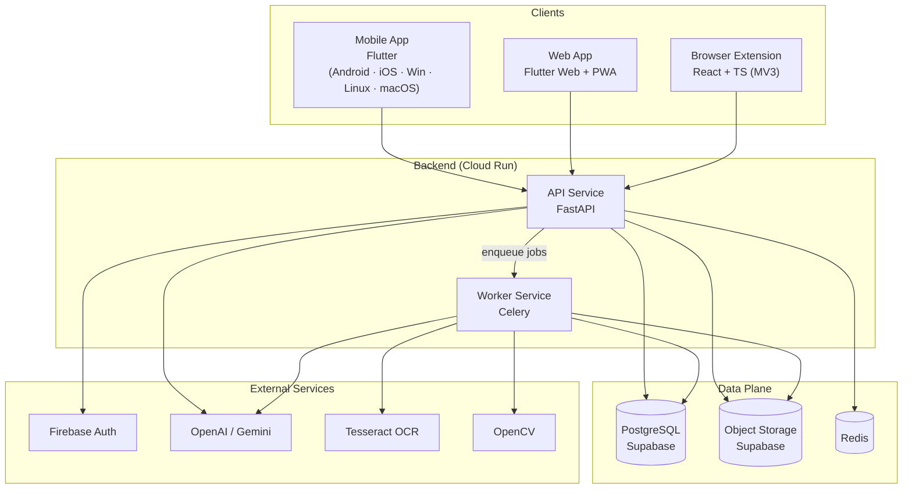

# C4 — Container Diagram (Level 2)

The major deployable containers and their relationships. Canonical source for the
level-2 view.

## Container responsibilities

| Container | Tech | Responsibility | Key rules |
|---|---|---|---|
| Mobile / Web app | Flutter | Feature UI, sign-in, offline caching | Talks only to Backend API |
| Browser extension | React + TS | In-page verification | Never holds secrets |
| API Service | FastAPI | Validation, authn/authz, orchestration, API surface | Thin routes (ADR-0003) |
| Worker Service | Celery | OCR/forensics/LLM pipelines | Idempotent tasks (ADR-0008) |
| PostgreSQL | Supabase | Primary store, RLS | Accessed via repositories only |
| Object Storage | Supabase | Media blobs | Signed URLs, short expiry |
| Redis | Redis | Broker, rate limits, caches | Shared by API + workers |
| Firebase Auth / OpenAI / Gemini / Tesseract / OpenCV | External / libs | Identity, LLM, OCR, forensics | Never contacted by clients |
