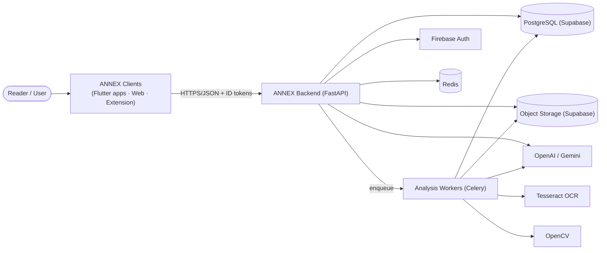

# C4 — System Context Diagram (Level 1)

The system boundary, external actors, and external systems. This file is the
**canonical source** for the level-1 view; `../overview.md` embeds a rendered copy.

## Reading the diagram

| Element | Meaning |
|---|---|
| Person (`(["..."])`) | An actor outside the system |
| System (`["..."]`) | ANNEX or an external system |
| Database (`[("...")]`) | A data store |
| Arrow | A dependency or data flow |

- **ANNEX Clients** are the only entry points for users.
- **Backend** coordinates; **Workers** execute long pipelines (see
  [component-analysis.md](./component-analysis.md)).
- External services (auth, AI, OCR, OpenCV) are never contacted directly by clients.
