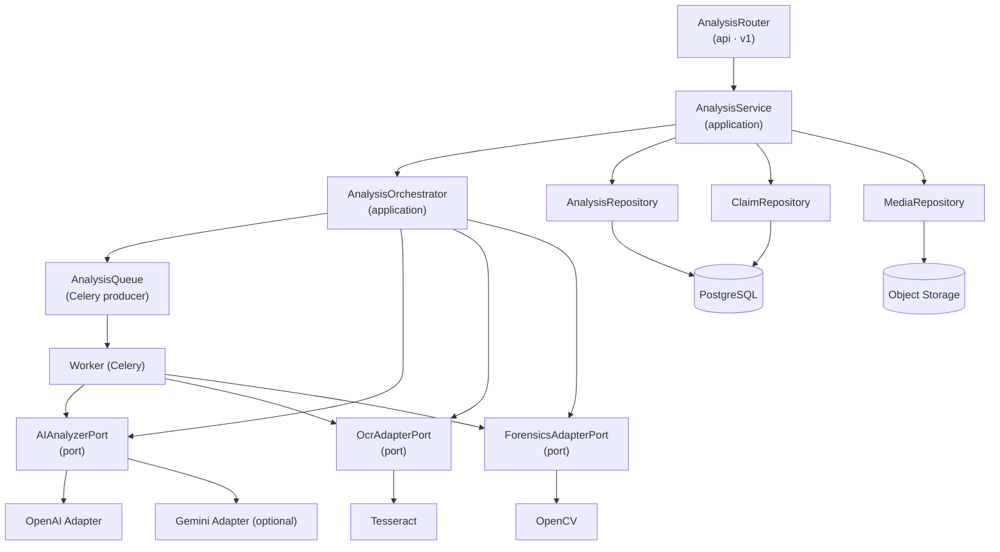

# Component Diagram — Analysis Pipeline

Component-level view of the backend's analysis pipeline, showing the layering from
ADR-0003 (api → application → infrastructure ports → adapters) and the async handoff
from ADR-0008.

## Layer rules in this diagram

- Routers depend only on services; services depend on ports and repositories.
- Adapters (OpenAI, Gemini, Tesseract, OpenCV, Supabase) are swappable behind ports.
- The worker reuses the same ports as the orchestrator — one implementation of the
  guarded AI calls, exercised from both request-scoped and job-scoped paths.
- Guard layer (ADR-0006) wraps every port implementation; not shown for clarity.
