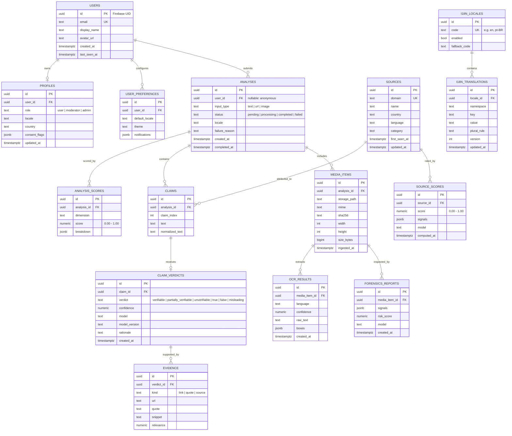

# Entity-Relationship Diagram — ANNEX Data Model

Logical data model (Phase 2 design). Full column definitions, constraints, indexes,
and RLS policies are specified in [../../database/schema-design.md](../../database/schema-design.md);
executable DDL ships with migrations in Phase 4.

