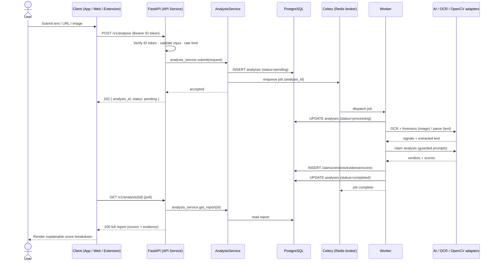

# Sequence Diagram — Analysis Request

End-to-end trace of a user submitting content for analysis. Shows the async handoff
(202 + polling) from ADR-0008 and where the guarded AI/OCR/forensics work runs.

## Notes

- All arrows from `C` to `A` carry a verified Firebase ID token (ADR-0005).
- The worker path is **idempotent**: a re-delivered job re-checks `analysis_id`
  before writing (ADR-0008).
- If any step fails: `status=failed` with a structured error; the client renders a
  retry affordance.
