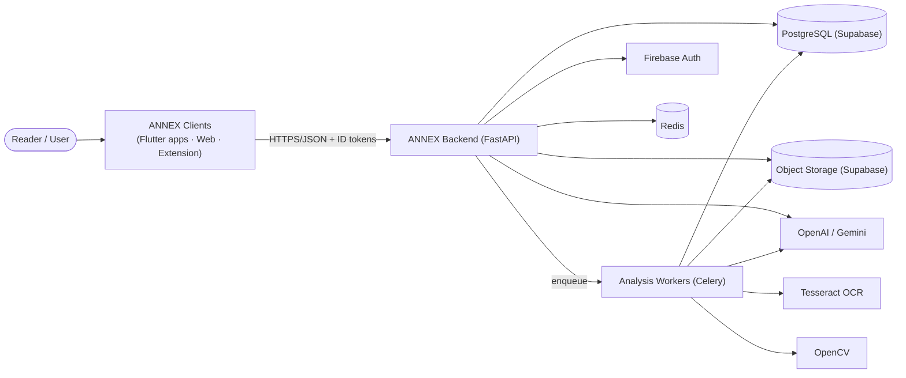
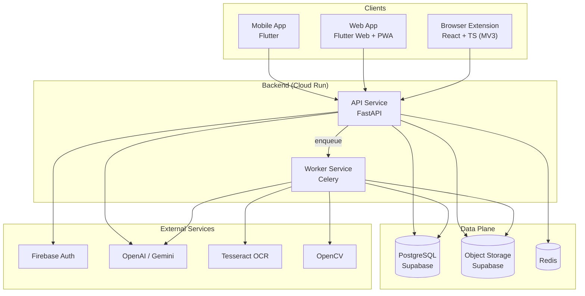

# ANNEX Architecture Overview

> **Status:** Accepted baseline · **Phase:** 2 · **Scope:** System-level blueprint for
> the whole platform · **Related:** [Decisions (ADRs)](./decisions/),
> [Diagrams](./diagrams/), [Database schema](../database/schema-design.md),
> [API map](../api/v1-endpoints.md)

This document is the entry point for understanding how ANNEX is built. It uses the
[C4 model](https://c4model.com/): **System Context** (level 1) and **Containers**
(level 2). Component-level detail for the analysis pipeline is in
[component-analysis.md](./diagrams/component-analysis.md); the runtime behavior of an
analysis request is in [sequence-analysis.md](./diagrams/sequence-analysis.md).

---

## 1. System Context (C4 Level 1)

### Mission

> Build the world's most advanced AI-powered Media & Information Literacy platform.
> **Learn Before You Believe.**

ANNEX lets a reader verify text, URLs, and images *before* sharing them: claims are
decomposed and checked, sources are credibility-scored, images are forensically
inspected (OCR + tamper signals), and every verdict is explained with evidence.

### External actors

| Actor | Description |
|---|---|
| **Reader / User** | Submits text, URLs, or images for analysis; browses scores, lessons, and history. |
| **Educator (future)** | Curates media-literacy lessons and assignments (extendable, out of MVP scope). |

### System responsibilities

1. Accept and validate analysis requests from any client (app, web, extension).
2. Orchestrate AI, OCR, and image-forensics pipelines asynchronously.
3. Produce transparent, evidence-linked credibility scores.
4. Serve multilingual UI content without client rebuilds.
5. Protect user data with authentication, authorization, and rate limiting.

### System context diagram

Canonical source: [`c4-context.md`](./diagrams/c4-context.md). Rendered copy:

---

## 2. Containers (C4 Level 2)

| Container | Technology | Responsibility |
|---|---|---|
| **Mobile app** | Flutter (Android, iOS, Windows, Linux, macOS) | Feature UI, offline-first caching, sign-in via Firebase SDK |
| **Web app** | Flutter Web + PWA | Same product on the web, hosted on Firebase Hosting |
| **Browser extension** | React + TypeScript (Manifest V3) | In-page verification, context menus, screenshot pipeline |
| **Backend API** | FastAPI (Python 3.14) | Auth token verification, validation, service orchestration, API surface |
| **Analysis worker** | Celery (Python) | Long-running pipelines: OCR, forensics, claim analysis, embeddings |
| **PostgreSQL** | Supabase managed | Primary store, RLS as defense-in-depth |
| **Object storage** | Supabase Storage | Media blobs with signed, expiring URLs |
| **Redis** | Managed / Docker | Celery broker+results, rate-limit counters, hot caches |
| **Firebase Auth** | External | Identity: Google, Apple, email/password, anonymous |
| **OpenAI / Gemini** | External | Claim analysis, summarization, embeddings |
| **Tesseract / OpenCV** | Libraries in worker image | OCR text extraction, image tamper signals |

### Container diagram

Canonical source: [`c4-containers.md`](./diagrams/c4-containers.md).

---

## 3. Core data flows

### 3.1 Analysis request (synchronous handoff, async work)

1. Client submits text/URL/image → `POST /v1/analysis` with a verified Firebase ID token.
2. API validates input, persists a `pending` analysis, enqueues a Celery job.
3. Client receives `202 Accepted` and polls `GET /v1/analysis/{id}`.
4. Worker runs OCR/forensics, then guarded LLM analysis; writes verdicts and scores;
   transitions status to `completed` (or `failed` with a structured error).
5. Client renders the explainable score breakdown.

Full trace: [sequence-analysis.md](./diagrams/sequence-analysis.md).

### 3.2 Multilingual content delivery

1. Apps reference stable, typed string keys — never hardcoded prose.
2. The backend serves versioned locale bundles (`GET /v1/i18n/bundles/{locale}`).
3. Clients cache bundles and fall back `locale → parent → en`.
4. Adding a language = adding translations server-side. **No client rebuild.**

---

## 4. Cross-cutting concerns

| Concern | Approach | Where enforced |
|---|---|---|
| Authentication | Firebase ID tokens verified server-side on every request | API middleware (Phase 5) |
| Authorization (RBAC) | Role checks in the service layer, never only in UI | Services (Phase 5) |
| Rate limiting | Redis-backed counters on auth, analysis, public endpoints | API middleware (Phase 7) |
| Input validation | Strict Pydantic/JSON-Schema validation; unknown fields rejected | API boundary (Phase 3) |
| Prompt injection | All model output and user content treated as untrusted; guard layer | AI adapters (Phase 6) |
| i18n | Runtime bundles + fallback chain; typed keys | Apps + backend (Phase 8) |
| Observability | Structured logs with request IDs, per-request tracing of AI calls | Core (Phase 3) |
| Secrets | Environment/secret-manager only; never in images or binaries | All phases |

---

## 5. Quality gates

- Every phase ends with a working validation gate (see [testing guide](../guides/testing.md)).
- Architecture changes require an ADR before implementation
  (see [ADR template](./decisions/template.md)).
- The repository validation script (`scripts/validate_repo.py`) runs in CI on every
  change and must pass locally before commit.
